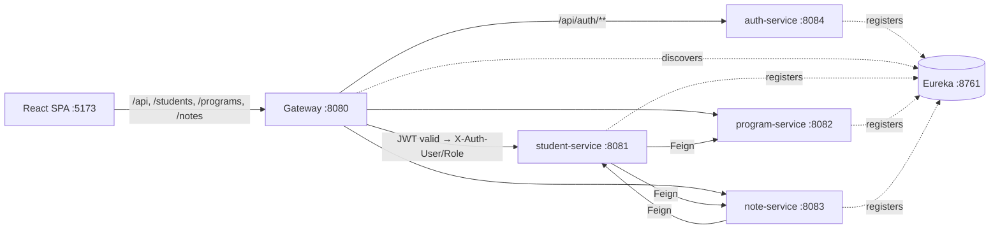
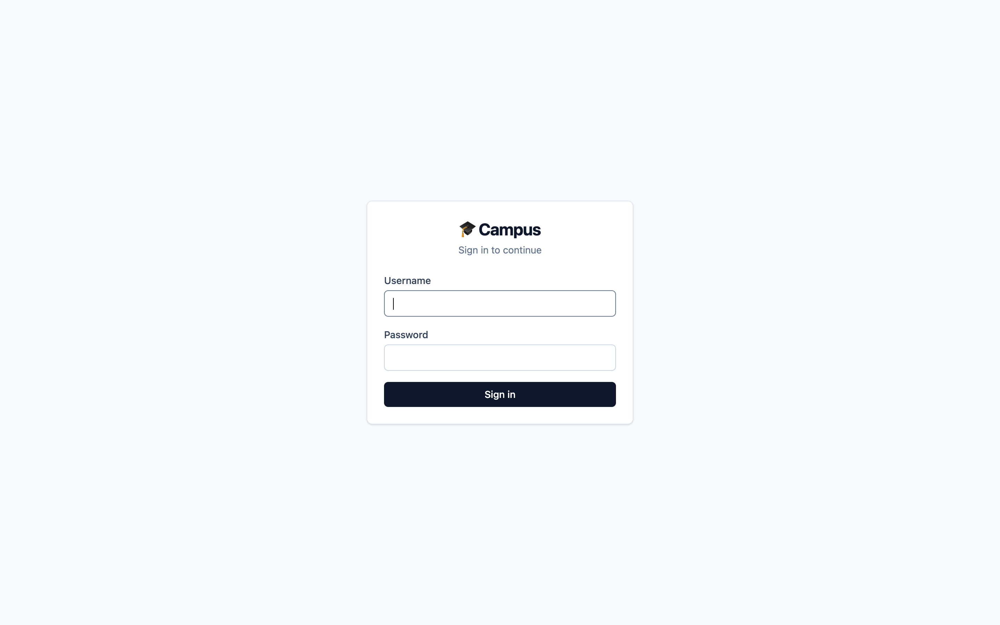
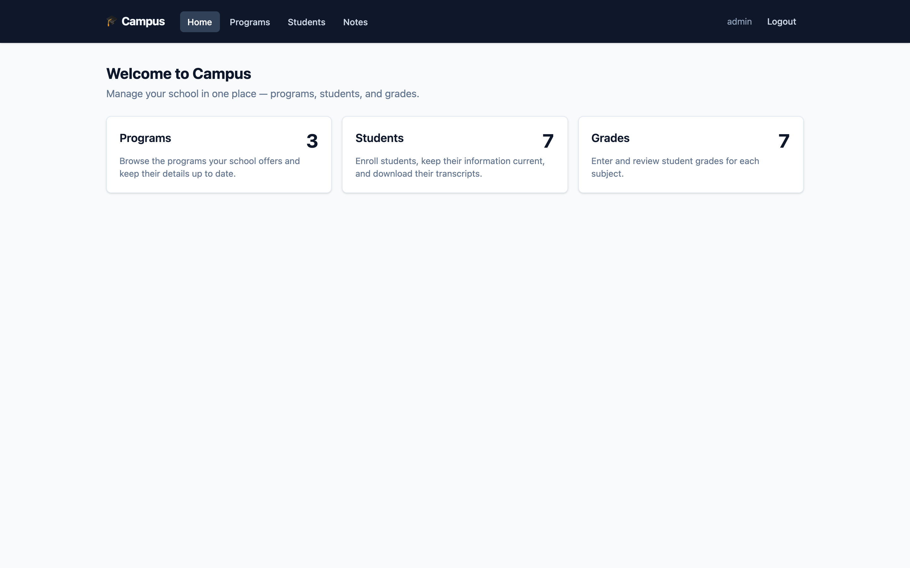
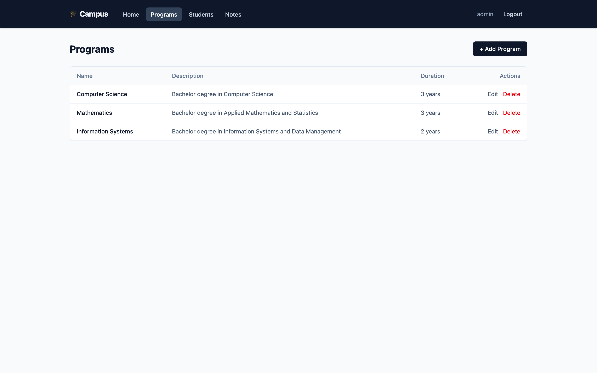
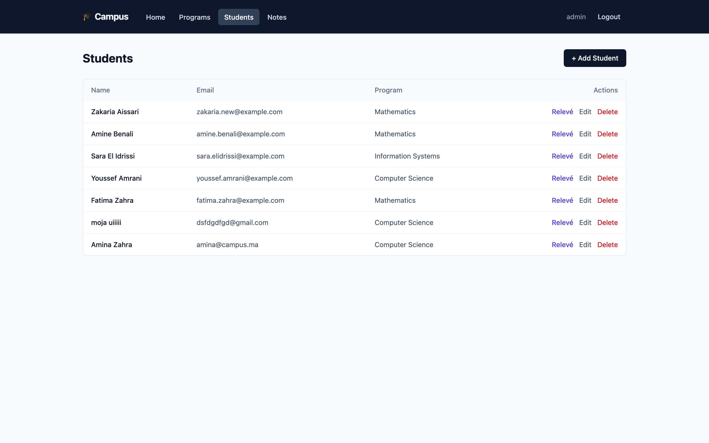
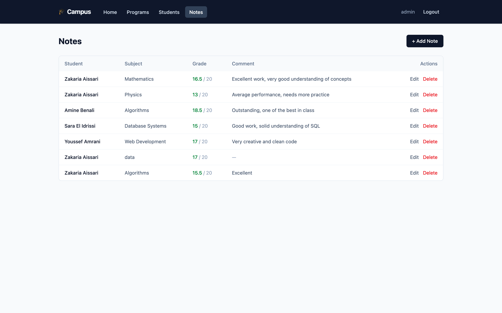
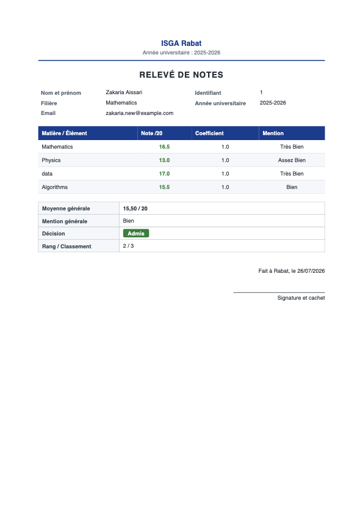

# Campus — School Management Microservices

A campus / school-management system built as **Spring Cloud microservices** with a
**React single-page app**. It manages academic **Programs**, the **Students** enrolled in
them, and the **Notes/grades (0–20)** each student earns per subject — with weighted
averages and a printable **relevé de notes** (transcript, PDF). Access is protected by
**JWT authentication** with a single ADMIN role. Every request from the frontend goes
through the API gateway on port `8080`.

---

## Architecture

| Service             | Port  | Role                                                                                  |
|---------------------|-------|---------------------------------------------------------------------------------------|
| `discovery-service` | 8761  | Eureka service registry — every service registers here                                |
| `gateway-service`   | 8080  | Spring Cloud Gateway — single entry point, routing, and JWT validation (global filter)|
| `auth-service`      | 8084  | Authentication: users, login, JWT issuing, rotating refresh tokens (`auth_db`)        |
| `student-service`   | 8081  | Students CRUD + relevé/transcript aggregation & PDF (`db_students`)                   |
| `program-service`   | 8082  | Programs CRUD (`db_programs`)                                                          |
| `note-service`      | 8083  | Notes/grades CRUD, grade 0–20 with coefficient (`db_notes`)                           |

**Data relationships:** `Program → Student → Note`. student-service enriches its responses
with the student's Program and builds the transcript from the student's Notes, both fetched
over **OpenFeign**; note-service enriches notes with their Student the same way.

### Request flow



Plain-text flow: `Browser → Gateway (:8080)` → the gateway validates the JWT (except
`/api/auth/**`), injects `X-Auth-User` / `X-Auth-Role`, and forwards via `lb://` (Eureka)
to the target service. auth calls go to auth-service unauthenticated.

---

## Tech stack

**Backend** (Java 17, Maven multi-module, Spring Boot 3.2.5 / Spring Cloud 2023.0.1)
- Spring Cloud **Netflix Eureka** (discovery) and **Spring Cloud Gateway** (reactive/WebFlux)
- **OpenFeign** for inter-service calls (student↔program, student↔note, note↔student)
- **Spring Data JPA / Hibernate** + **MySQL** (`mysql-connector-j`), one database per service
- **Spring Security** + **jjwt 0.12.6** (HS256) in `auth-service`; jjwt validation in the gateway
- **Thymeleaf** + **openhtmltopdf (PDFBox) 1.0.10** in `student-service` for the transcript PDF
- Spring Boot **Actuator**

**Frontend** (`frontend/`)
- **React** + **TypeScript**, built with **Vite**
- **TanStack Query** (server state), **React Router** (routing), **axios** (HTTP)
- **Tailwind CSS** for styling, **oxlint** for linting

> Everything above is what's actually declared in the `pom.xml` files and
> `frontend/package.json`.

---

## Authentication

- **One role: `ADMIN`.** A default **`admin` / `admin`** account is seeded on first boot of
  auth-service.
- **Access token:** short-lived JWT (15 min, HS256), returned in the login response body and
  held **only in memory** on the frontend (never localStorage).
- **Refresh token:** rotating and revocable, stored **SHA-256-hashed** in `auth_db`, delivered
  as an **httpOnly cookie** scoped to `/api/auth` (SameSite=Lax; `Secure` configurable).
- **Validation happens only at the gateway** via a reactive global filter: it skips
  `/api/auth/**`, requires `Authorization: Bearer <jwt>` on everything else (401 otherwise),
  and injects `X-Auth-User` / `X-Auth-Role` downstream. The business services are not aware of
  JWTs.
- `app.jwt.secret` **must be identical** in `auth-service` and `gateway-service`.

**Auth endpoints** (`POST`): `/api/auth/register`, `/api/auth/login`, `/api/auth/refresh`,
`/api/auth/logout`.

---

## Prerequisites

- **Java 17**
- **Maven 3.9+**
- **Node 18+**
- **MySQL** running on `localhost:8889` (the datasource URLs use port `8889`; databases are
  auto-created via `createDatabaseIfNotExist=true`)

## Configuration (environment variables)

Secrets are **not** committed — they are read from the environment:

| Variable       | Used by                       | Default | Notes                                              |
|----------------|-------------------------------|---------|----------------------------------------------------|
| `JWT_SECRET`   | auth-service, gateway-service | _none_  | **Required.** Must be the **same** value for both. |
| `DB_PASSWORD`  | student/program/note/auth     | `root`  | MySQL password.                                    |

```bash
export JWT_SECRET="a-long-random-string-at-least-32-characters-long"
export DB_PASSWORD="root"   # optional; defaults to root
```

---

## How to run

Build everything once:

```bash
mvn clean package -DskipTests
```

Then start the services **in this order** (each in its own terminal, or with `&`):

```bash
# 1. Service registry (wait until it's up on :8761)
java -jar discovery-service/target/discovery-service-1.0.0.jar

# 2. Gateway (needs JWT_SECRET)
java -jar gateway-service/target/gateway-service-1.0.0.jar

# 3. Business services
java -jar program-service/target/program-service-1.0.0.jar
java -jar student-service/target/student-service-1.0.0.jar
java -jar note-service/target/note-service-1.0.0.jar

# 4. Auth service (needs JWT_SECRET, same value as the gateway)
java -jar auth-service/target/auth-service-1.0.0.jar

# 5. Frontend
cd frontend && npm install && npm run dev
```

- **Frontend:** http://localhost:5173 (Vite dev server; it proxies API calls to the gateway).
- **Login:** `admin` / `admin`.

> Tip: services register with Eureka using their IP (`prefer-ip-address: true`). If your
> machine's IP changes (network switch / sleep), restart the business services so they
> re-register, otherwise the gateway can't reach them.

## API entry point

All traffic goes through the **gateway on `http://localhost:8080`**:

| Area     | Routes (via gateway)                                                                 |
|----------|--------------------------------------------------------------------------------------|
| Auth     | `POST /api/auth/{register,login,refresh,logout}`                                     |
| Programs | `GET/POST /programs`, `GET/PUT/DELETE /programs/{id}`                                 |
| Students | `GET/POST /students`, `GET/PUT/DELETE /students/{id}`                                 |
| Notes    | `GET/POST /notes`, `GET/PUT/DELETE /notes/{id}`, `GET /notes/student/{studentId}`     |
| Relevé   | `GET /api/students/{id}/releve` (JSON), `GET /api/students/{id}/releve/pdf` (PDF)     |

Sample requests are in [`http-tests/api-tests.http`](http-tests/api-tests.http).

---

## Project structure

```
.
├── pom.xml                 # Maven parent (aggregates the modules below)
├── discovery-service/      # Eureka registry (8761)
├── gateway-service/        # API gateway + JWT global filter (8080)
├── auth-service/           # Auth: users, JWT, refresh tokens (8084)
├── student-service/        # Students + relevé/transcript PDF (8081)
├── program-service/        # Programs (8082)
├── note-service/           # Notes / grades (8083)
├── frontend/               # React + TypeScript + Vite SPA
│   └── src/
│       ├── api/            # axios instance + per-resource calls
│       ├── auth/           # AuthContext + ProtectedRoute
│       ├── components/     # Navbar, Modal, forms, relevé preview…
│       ├── hooks/          # TanStack Query hooks
│       ├── pages/          # Login, Home, Programs, Students, Notes
│       └── types/          # TypeScript models mirroring the DTOs
├── http-tests/             # .http request samples
└── docs/screenshots/       # images used by this README
```

---

## Interfaces

### Login

Username / password sign-in (default `admin` / `admin`); unauthenticated users are redirected here.

### Home dashboard

Landing page with live counts of programs, students, and grades, linking to each section.

### Programs

List of programs with create / edit (modal) and delete.

### Students

Students with their program, plus create / edit / delete and a **Relevé** action per row.

### Notes (grades)

Grades per student and subject (0–20, with coefficient), colour-coded pass/fail.

### Relevé de notes (transcript export)

Official French transcript: student + program header, notes table, computed moyenne, mention,
décision (Admis/Ajourné) and rang — viewable in-app and downloadable as a styled PDF.
